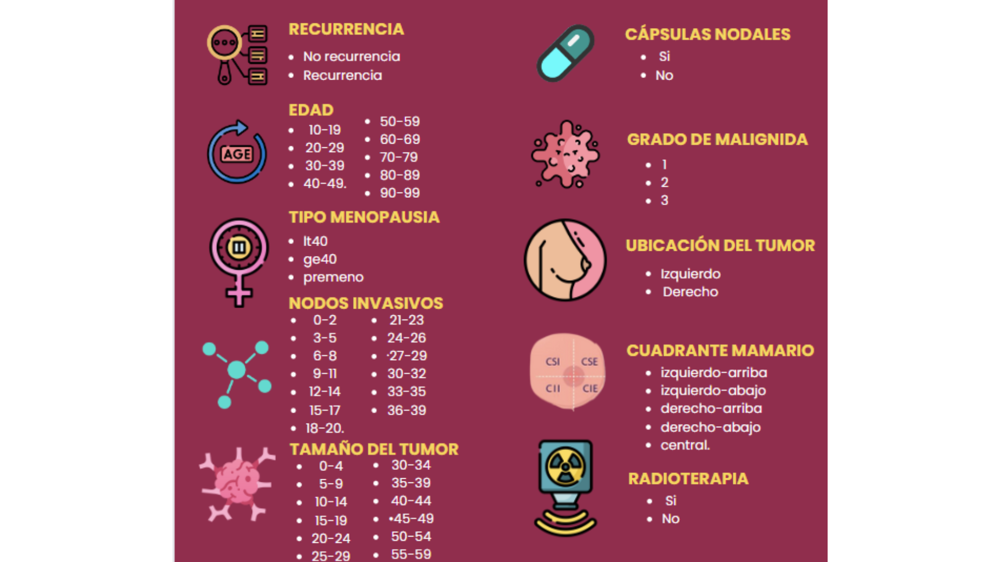

# Base de datos: breast-cancer

En este proyecto se utiliza la base de datos breast-cancer.data, la cual fue obtenida del Centro Médico Universitario, Instituto de Oncología, Ljubljana, Yugoslavia. Agradecemos a M. Zwitter y M. Soklic por proporcionar los datos. 

## Problematica 
Considerando que para el año 2020 se registraron 2,3 millones de casos nuevos de cáncer de seno en mujeres a nivel mundial ”
-Organización Mundial de la Salud, 2023.
y teniendo en cuenta la informacion obtenida de la base de datos, se econtró que hay carencia de informacion precisa sobre la evolución del cáncer de seno en diferentes grupos de pacientes. 
## Contenido 
1. Base de datos sin proceso de limpieza (breast-cancer)
2. Base de datos limpia (Proyecto_Gestion_BD)
3. Codigo para la limpieza de la base de datos (Limpieza_de_datos.ipynb) 
* Instalaciones de librerias necesarias e importacion del data set.
* Visualizacion de la informacion del data set 
* Creeacion de la copia del dataset
* Datos repetidos
* Comteo de datos nulos 
* Limpieza de datos categoricos
* Grafico de caja para visualizacion de datos atipicos (variable numerica)
* Graficos comparativos con la variable objetivo ( deg_malig)
4. Codigo para implementacion de funciones y manipulacion de base de datos en MySql (Manipulación_de_datos.ipynb)
* Intalacion e importacion de librerias
* Creacion de la base de datos 
* Creacion de tabla
* Envio de data frame a BD MySql
*  Comprobacion de subida del data frame 
* Creacion de graficos a partir de los datos traidos de la BD
* Consultas SQL (CRUD) para simular la manipulación de la base de datos

## BD breast-cancer
### Tipo de datos de cada caracteristica:
* **Class** (object) \
* **age** (object)\
* **menopause** (object)\
* **tumor-size** (object)\
* **inv-nodes** object()\
* **node-caps** (object)\
* **deg-malig** (int)\
* **breast** (object)\
* **breast-quad** (object)\
* **irradiat** (object)\
### Caracteristicas: 

## Conclusiones 

## Valor generado para empresas